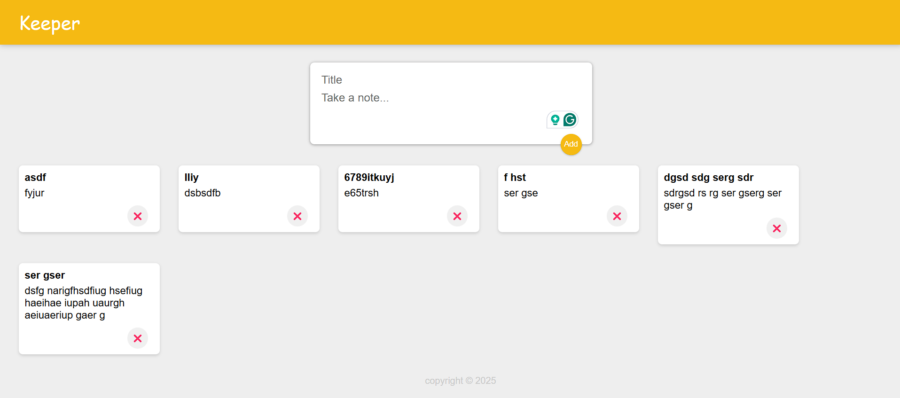

# 📝 Keeper App

A simple note-taking app built with React. Users can add and delete notes in a clean and minimal UI.

---
## 🔍 Preview
- Live - https://dipan46.github.io/keeper-app/

## 🚀 Features

- Add notes with a title and content
- Delete notes
- Dynamic UI updates using React Hooks (`useState`)
- Component-based structure for modularity

## 📁 Project Structure

```
src/
│
├── App.jsx              # Main component handling state and rendering
├── App.css              # Styles
├── assets/
│   ├── CreateArea.jsx   # Form component to create a new note
│   ├── Header.jsx       # App header
│   ├── Footer.jsx       # App footer
│   ├── Note.jsx         # Individual note component
```

## 🛠️ Tech Stack

- React
- JavaScript
- HTML/CSS

## 💻 How to Run

1. Clone the repository:
   ```bash
   git clone https://github.com/Dipan46/keeper-app.git
   ```

2. Navigate to the project folder:
   ```bash
   cd keeper-app
   ```

3. Install dependencies:
   ```bash
   npm install
   ```

4. Start the development server:
   ```bash
   npm run dev
   ```

## 📸 Preview



## 🧑‍💻 Author

Made with ❤️ by [Dipan46](https://github.com/Dipan46)

## 📄 License

This project is open-source and available under the [MIT License](LICENSE).
